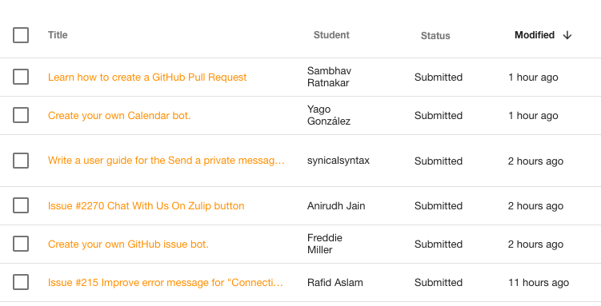

# Introduction

Whether you are a new or experienced GCI participant, a GCI mentor or a
Zulip contributor who wants to know a bit more about our GCI experiences -
welcome!

This document is intended to summarize lessons learned over the first few
weeks of Google Code-In at Zulip. It is also a shared reference of
experiences and ideas on growing together for both students and mentors.
As such it's open for further suggestions and improvements, to learn the
most from diverse experiences.

It also includes answers to many common questions and issues raised during
code reviews and discussions on Zulip.
[Social rules](#what-are-the-social-rules), [GCI tasks](#how-gci-tasks-work),
and some ideas on [going beyond GCI](#how-do-i-go-beyond-gci-tasks)
have been discussed here.

# What are the social rules?

As a Zulip contributor, you should adhere to our [community code of
conduct](https://zulip.readthedocs.io/en/latest/code-of-conduct.html).
There are also some GCI lessons learned:

* Respect time and effort others are investing in their contributions and
communication.

* Be mindful of others' time - fellow participants are also waiting for their
reviews in the task queue and mentors are managing multiple responsibilities
while online.

* Never assume malice - if you are waiting for review or an answer, it's
usually because the other person is busy with their work, unavailable or
waiting for you to answer their questions.

* Be mindful of cultural differences - both participants and mentors come
from different backgrounds (including countries, languages and cultures),
please remember some nuances might be interpreted differently than you'd
expect.

* Please don't at-mention people just to bug them to them to look at your
task or help you with a problem they have already expressed interest in -
all of the mentors are reading through the feed as quickly as they can,
while helping people.

If you are new to the concept of the netiquette, please read this [helpful
resource](http://www.albion.com/netiquette/).

# How GCI tasks work?

GCI participants are required to complete tasks that have been published in
the GCI app. In order to start working on a task, a student has to claim it
in the app. When they've finished the task, they need to submit it in the
app for review. A student can have only one active (claimed or submitted)
task at a time.

### Is GCI all about the number of tasks?

In the [GCI
rules](https://developers.google.com/open-source/gci/resources/contest-rules)
there are two important factors for choosing finalists and grand-prize
winners.

* Number of tasks
  > Each complete task entry is worth one (1) point.

* Other factors
  > Each entry will be judged according to the following factors: creativity,
  thoroughness, and quality of work. The Organization may additionally factor
  the contestant’s involvement in the Organization’s community in the judging.  

In order to be considered for the grand-prize, a student needs to be in the
top-10 in terms of number of tasks.  

While the number of tasks is important, the winning students are often
chosen for not only the number of tasks that they completed but also their
willingness to help other students and participate in the community. Fixing
an issue in the project that happens to not have a GCI task is worth just as
much as completing a GCI task for that issue.

Being in the top-10 is a requirement, but the student with the most
completed tasks won't necessarily win the grand-prize. The number of tasks
of the top-10 students is not a factor for us, since some tasks are much
easier or harder than other tasks.

## How do I make sure none of my contributions are forgotten?

If you are worried that some of your contributions may not be taken into
account when choosing the winners, you can create a document which lists
the achievements that were not GCI tasks.

You can see an example format for this document
[here](https://paper.dropbox.com/doc/GCI-achievements-example-CT1htUQQnkFkZE1k27ql2).
If you create your achievement document, you can add it to [this
list](https://docs.google.com/spreadsheets/d/1eF2xi5_ZrpURH5N_VV99C8o-deLh-A5YjNwWLc4opik/edit?usp=sharing).

**Note**: This is not a requirement for the GCI students. We simply want to
give students a simple way of showcasing all of their achievements. We will
still review pull requests, issues, and Zulip threads in addition to the GCI
tasks they've completed.

## Why should I claim a task before working on it?

The [GCI
rules](https://developers.google.com/open-source/gci/resources/contest-rules)
require you to claim a task before you start working on it. It's recommended
since students can't see the number of instances available and it may happen
that someone else claims the last instance before you can claim it. Your work
won't then be applicable for review.

The reason for this rule is that everyone should get a fair chance at doing
the task and fulfilling the requirements. It's discouraging for other
students to find out someone else has already done the task they've been
working on.

The workflow for completing GCI tasks:

* Student claims the task.

* Student works on the tasks and makes sure it fulfills all the requirements.

* Before submitting the task, they check that the task passes all the tests
(including Travis tests and manual testing of the feature).

* Student submits the task in the GCI app and waits for a review - they
should focus on other endeavors while waiting (you can find some ideas on
what to do in the [going beyond GCI](#how-do-i-go-beyond-gci-tasks) section).

* The task is going through the review process, with refactoring and
improvements required by mentors.

* The task is accepted when a mentor assesses it as fulfilling the task
requirements - this doesn't necessarily mean the pull request will be merged
at the same time. Sometimes the best expert to do a final review and merge
the pull request is not available, but the mentors are reasonably confident
the work on the task is complete. We still expect the students to address
any feedback on their work after the task has been approved.

## How does the review process work?

It's good to have more than one mentor look at your contribution, since they
can focus on different aspects of it. The main aspects we focus on with the
GCI tasks:

* General task requirements - the files are named properly and created in the
right folders, the commit messages are following both the specific task
description and the [Zulip commit discipline
doc](https://zulip.readthedocs.io/en/latest/contributing/version-control.html#commit-discipline)
etc.

* Task functionality - the submission implements the required functionality
appropriately.

* Code quality and style (as in the [Zulip code style
  doc](https://zulip.readthedocs.io/en/latest/contributing/code-style.html)).

* Passing the test suite.

* Passing manual tests - mentors will tests various use cases of the feature
and try to find cases when it doesn't work. Make sure to do manual testing
before submitting your work for review.

* Documentation (e.g. Markdown files) renders properly and is nicely
readable.

* User docs adhere to the
[style guide](https://zulip.readthedocs.io/en/latest/subsystems/user-docs.html).

We also apply rules described in the [Zulip
review doc](https://zulip.readthedocs.io/en/latest/contributing/code-reviewing.html).

## Why is it taking so long for the mentors to check my task?

With reviewing the GCI tasks we prioritize fairness and transparency. We are
open to helping students whenever they require assistance, but we also keep
in mind that both GCI and being a great open-source contributor in general
is about individual contributions and work. It wouldn't be fair to the
students who are submitting tasks to get blocked because others might be
more vocal on chat. We try to prioritize submitted tasks over chat if we
only have time for one.

We're trying to keep response times to minimum and one of the more objective
resources we have is the queue in the GCI app (example screenshot below).
If you've been working on your task and asking for help on chat, you need to
submit the task and it will be queued in the app. It's not a perfect solution,
but keeping with the queue assures we are more objective than by simply
attending only to students active on Zulip chat.

Other important points about the response times:

* Mentors are working shifts across multiple timezones, to assure the best
coverage - if a mentor is online, it doesn't mean they're working on the
GCI tasks, since we also have our own tasks for Zulip when not on shift.

* The [GCI roles and responsibilities](https://developers.google.com/open-source/gci/help/responsibilities)
 have some general rules about response times:
  > Respond to questions within 24 hours (occasionally under 36 hours is ok)

* If it's been more than four hours since you've gotten attention from a
mentor, it's reasonable to post something on your task topic that says
you've been waiting for a while. Include useful things like your PR link,
your task link, and a short status of where things left off with the
previous mentor. Including these links will help us get up to speed with
your task and save time otherwise spend on looking for relevant information.

* Remember that multiple mentors are going to check your work - be sure to
answer all of their questions and address any issues they point out. Any
mentor can approve a task in the GCI app if it fulfills the requirements.
They sometimes need to consult with contributors more experienced in a
given area, to make sure all the requirements were fulfilled.

* If you're not getting a quick response from a mentor, take the time to
double-check your work or find other constructive things to do. Make sure
you don't have idle time - note down your learning progress, seek out new
challenges, work on a Python tutorial etc.

  In any software development community, double-checking your work and
  making sure it is high quality is the single most valuable thing you can
  do to minimize the time you're waiting for feedback, since it decreases
  the number of round trip times you need to wait for feedback.

### What does a mentor shift look like?

In order of priority, mentor tasks include:

* Checking the queue on the GCI app and reviewing all submitted tasks.

* Answering questions on Zulip - getting into the context, looking for
resources.

* Checking `zulip-gci` and `zulip` repositories for relevant pull requests.

## How can I ask for help?

* Before you ask a question, make sure you understand the problem and try to
solve it on your own first - we encourage a [you must try, and then you must
ask](https://blogs.akamai.com/2013/10/you-must-try-and-then-you-must-ask.html)
approach. Have a hypothesis on what might be the problem.

* Look for answers on your own using:

  * [Zulip documentation](https://zulip.readthedocs.io/en/latest/).

  * Documentation for the libraries and other tools you're using.

  * Simple Google searches, e.g. `python import a library`.

  * [StackOverflow](https://stackoverflow.com/) and
  [Quora](https://www.quora.com/) threads on relevant topics.

* Make sure your message has all the relevant information:

  * Give context - link the task you're working on, provide information on
  the expected outcome and what you're getting instead, post any traceback
  relevant to the issue.

  * Describe what you have already tried to achieve your goal.

  * Make sure to add any relevant links, screenshots, code snippets.

  * Format the message appropriately - use \`\`\` for long snippets (put
  them on separate lines before and after your snippet) and \` for
  short ones, name your links with Markdown formatting (e.g.
  `[link description](<link_address>)`), add headers in comments on GitHub
  etc.

* Keep the communication public, for two main reasons:
  * Other students can have similar problems, so they might help you or
  benefit from the discussion on your question.

  * Mentors are working shifts and they need context to be able to help you -
  if you send private messages to one mentor, not all the information
  might be available to the person who's helping you.

* When you get suggestions and pointers for your next steps, get back to
working on your problem and try to figure it out. Try not to take more than
15 minutes of mentor time at a time and ask questions relevant to the issue
at hand.

* Don't ask for direct answers on code and implementation (e.g. `How should
this line look exactly?`). Be proactive while solving the problem - mentors
and other students are here to help you learn, not do the task for you.

## How can I ask mentors to create a task?

If you want to work on something that's not currently a GCI task, e.g. a
Zulip issue you've found on GitHub, you can ask a mentor to create a task.
Provide the relevant resources, including the link to the issue.

Because of how the GCI app works, mentors can only create tasks that
administrators have to publish - they'll ask one of our organization GCI
admins to publish the task, but it might take a moment before they can get
around to it.

# How do I go beyond GCI tasks?

GCI is an opportunity for the students to become open-source contributors
and better programmers. We don't see your contributions as merely fulfilling
the task requirements, but believe it's a great way to grow and learn the
skills that will be beneficial for you in the long term.

Whenever you have some idle time, e.g. waiting for a review on your task or
provisioning your virtual machine, you can spend it productively by learning
or helping others. This section includes some ideas on what you can do.

## Learning opportunities

* Use Zulip resources:
  * Read [Zulip documentation](https://zulip.readthedocs.io/en/latest/).

  * Look through [current issues](https://github.com/zulip/zulip/issues),
  especially the [bite-size
ones](https://github.com/zulip/zulip/issues?q=is%3Aopen+is%3Aissue+label%3A%22bite+size%22).

  * Read [Tim's post on
  mypy](https://blog.zulip.org/2016/10/13/static-types-in-python-oh-mypy/).

  * Read Alicja's blog posts on
  [mentoring](https://trueskawka.github.io/zulip/outreachy/gci/blog/2017/01/03/to-mentor.html)
  and
  [being mentored](https://trueskawka.github.io/zulip/outreachy/blog/2017/01/02/to-be-mentored.html).

* Use various online courses to help you grow, on topics such as *Python, web
development, git and GitHub, computer science*. Some examples of free
courses:

  * [Free Code Camp](https://www.freecodecamp.com/).

  * [Open Source Society University](https://ossu.firebaseapp.com/).

  * [The Hitchhiker's Guide to Python](http://docs.python-guide.org/en/latest/).

* Contribute to other OSS projects - [a list of projects good for
beginners](https://github.com/MunGell/awesome-for-beginners).

* Find other programming resources that'll help you grow, some examples:

  * Brandon Rhodes's [talk "The Mighty
  Dictionary"](http://pyvideo.org/pycon-us-2010/the-mighty-dictionary-55.html).

  * Allison Kaptur's blog posts, examples:
    * [Effective learning strategies for
    programmers](http://akaptur.com/blog/2015/10/10/effective-learning-strategies-for-programmers/).

    * [Systematic
    debugging](http://akaptur.com/blog/2013/07/24/systematic-debugging/).

  * Jessica McKellar's ["Building and Breaking a Python
  Sandbox"](http://pyvideo.org/pycon-us-2014/building-and-breaking-a-python-sandbox.html).

  * [Cache me if you can](https://us.pycon.org/2014/schedule/presentation/173/):
  memcached, caching patterns and best practices
  ([slides](https://speakerdeck.com/pycon2014/cache-me-if-you-can-memcached-caching-patterns-and-best-practices-by-guillaume-ardaud),
  [video](http://pyvideo.org/video/2578/cache-me-if-you-can-memcached-caching-patterns)).

* You can also check resources shared on the `GCI general` stream `reading
list` topic.

## Being a proactive contributor

### Discussing your ideas

When you are working on a task, various issues can come up. Whenever you
have doubts about your approach or someone comments your work and suggests
a different one, you should discuss your ideas.

If someone asks a question, they want to understand your reasoning behind
your choices. Discussion sometimes means also mindful disagreeing and that's
what one would expect in an open source project - we respect each others'
opinions and try to come up with a solution that's the most sensible
approach in a given context.

### Supporting other contributors

Whenever another contributor asks for help (be it a student or a mentor),
feel free to help them out. Sometimes simply asking the right questions or
pointing out a minor typo has an impact on improving their work.

When helping, remember to facilitate learning - instead of simply giving
direct answers about implementation and pointing out how someone should fix
their code, try to understand their needs. One of the long term benefits of
solving problems is learning how to solve them in the future.

You can also help other students with reviewing their pull requests on the
`GCI peer review` stream.

### Writing a discovery report

Every community member tends to forget how and why they came to join that
community, and what hurdles they had to overcome.

Experienced users tend to forget the obstacles they first faced, the
frustrations they encountered while going through the documentation, the
confusion when faced with new tools and processes. It's incredibly valuable
for a community to be reminded of that newcomer experience. Not only does it
help identify pain points of newcomers that the community can reduce, but it
can also be an eye-opening experience that challenges long-established
anti-patterns.

You can read more about discovery reports [here](https://www.mediawiki.org/wiki/Technical_communications/What_you_can_do#Write_a_discovery_report),
some good examples are available below:

* https://blog.wikimedia.org/2014/04/04/a-young-developers-story-of-discovery-perseverance-and-gratitude/
* https://blog.wikimedia.org/2014/03/31/a-junior-developer-discovers-mediawiki/
* https://blog.wikimedia.org/2014/03/27/tech-discovery-report-what-is-this-wikitech-thing-anyway/
