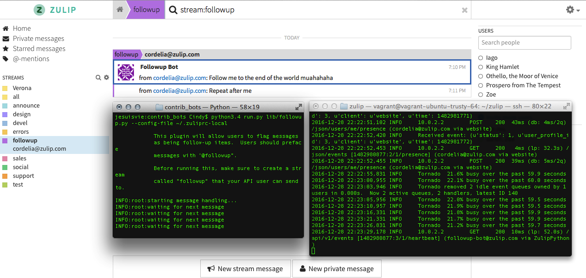
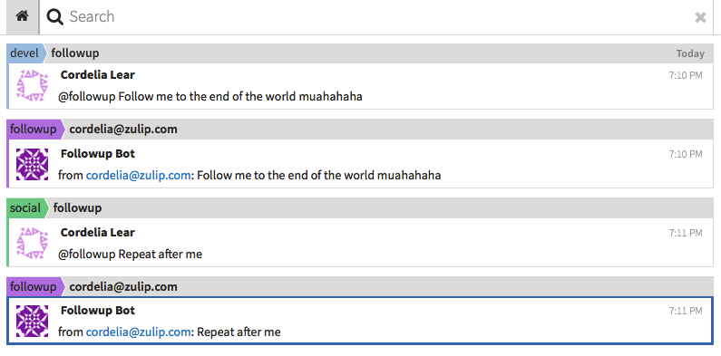

# Notes

**Operating System:** Mac OS X 10.9.5, Python 2.7, 3.4.2, 3.5.0 installed

**Development environment:** Vagrant, [http://localhost:9991/](http://localhost:9991/)

## Errors Encountered

My first error encountered occured when I was trying to create `~/.zuliprc-local`. My system would not allow me to add `.` to the beginning of my file name because it was reserved for the system, and all system files were hidden. I ran

```
$ defaults write com.apple.finder AppleShowAllFiles -bool YES
$ killall Finder
```

in Terminal to show all system files, and used my previously installed **NameChanger** application to force the name change. Thus, the file was able to be created and accessed.

---

Later, I encountered numerous `ImportErrors` while trying to run the bot for the first
time. Specifically, I encountered the following error messages:

```
$ python3 run.py lib/followup.py --config-file ~/.zuliprc-local Traceback
(most recent call last): File "run.py", line 16, in <module> from zulip import
Client File "../api/zulip/__init__.py", line 26, in <module> import simplejson
```

```
$ python3 run.py lib/followup.py --config-file ~/.zuliprc-local Traceback
(most recent call last): File "run.py", line 16, in <module> from zulip import
Client File "../api/zulip/__init__.py", line 27, in <module> import requests
ImportError: No module named 'requests'
```

```
$ python run.py lib/followup.py --config-file ~/.zuliprc-local

Traceback (most recent call last): File "run.py", line 16, in <module> from
zulip import Client File "../api/zulip/__init__.py", line 37, in <module> from
six.moves.configparser import SafeConfigParser ImportError: No module named
six.moves.configparser
```

```
$ python3 run.py lib/followup.py --config-file ~/.zuliprc-local Traceback
(most recent call last): File "run.py", line 16, in <module> from zulip import
Client File "../api/zulip/__init__.py", line 41, in <module> from typing import
Any, Callable, Dict, Mapping, Optional, Tuple, Union, Iterable, Text
ImportError: cannot import name 'Text'
```

To fix these errors, I installed the missing packages with `sudo pip install`.
However, I soon realized that I run `python3.4 run.py lib/followup.py
--config-file ~/.zuliprc-local` to launch the bot and `sudo pip3.4 install` to
install missing packages because of the following reasons:

* Python 3.5 comes with its own version of `typing`, which was added before the introduction of `typing.Type`. Python was picking up the standard library version instead of the version from `pip`, so I couldn't use Python 3.5 to run the bot; luckily, I had already previously Python 3.4 installed Python 3.4.

* Because I had multiple Python versions installed on my computer, I had to append `3.4` to my `python` and `pip` commands to specify that I was running them with Python 3.4.

With these changes, I was able to run the followup bot.

## Screenshots




