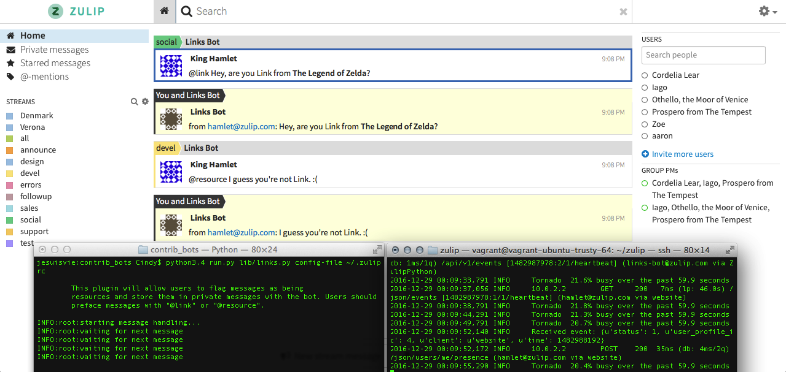

# Notes

## Errors Encountered

While trying to run `python3.4 run.py lib/links.py config-file
~/.zuliprc-local`, I encountered the following error:

```
$ python3.4 run.py lib/links.py config-file ~/.zuliprc-local
Traceback (most recent call last):
  File "run.py", line 124, in <module>
    run()
  File "run.py", line 120, in run
    quiet=options.quiet
  File "run.py", line 49, in run_message_handler_for_bot
    client = Client(config_file=config_file)
  File "../api/zulip/__init__.py", line 220, in __init__
    % (config_file,))
RuntimeError: api_key or email not specified and /Users/Cindy/.zuliprc does not exist
```
I fixed this error by renaming my `~/.zuliprc-local` file to `~/.zuliprc`.

## Screenshot


